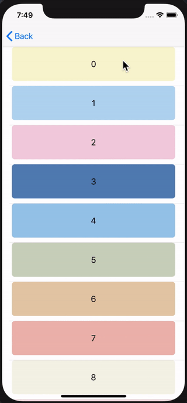
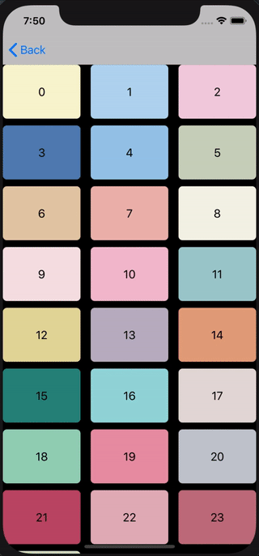
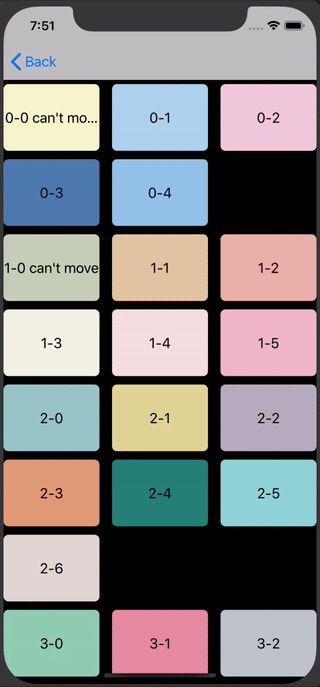
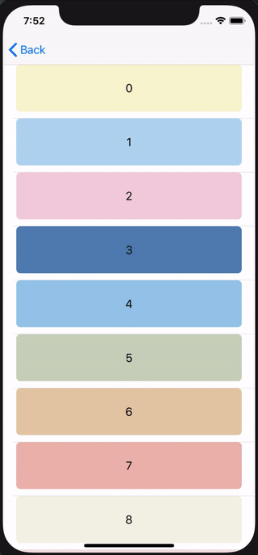
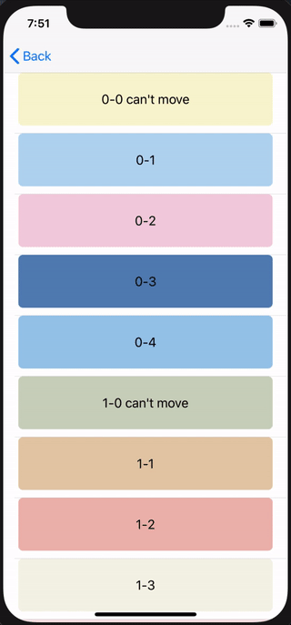

# Reorder

[](http://cocoapods.org/pods/Reorder)
[](http://cocoapods.org/pods/Reorder)
[](http://cocoapods.org/pods/Reorder)
[](https://developer.apple.com/swift/)

## Introduce





## Requirements

`Reorder` written in Swift 5.0. Compatible with iOS 8.0+

## Installation

### Cocoapods

Reorder is available through [CocoaPods](https://cocoapods.org). To install
it, simply add the following line to your Podfile:

```ruby
pod 'Reorder'
```

## Usage


### UITableView

```swift
class TableViewController: UIViewController {
    let tableView = UITableView(frame: .zero, style: .plain)
    var list = [[Int]]()

    override func viewDidLoad() {
        super.viewDidLoad()

        self.tableView.delegate = self
        self.tableView.dataSource = self
        self.tableView.reorder.delegate = self
    }
}

// MARK: TableViewReorderDelegate
extension TableViewController: TableViewReorderDelegate {
    var reorderSuperview: UIView {
        return self.navigationController?.view ?? UIView()
    }

    func tableViewReorder(_ tableView: UITableView, moveRowAt sourceIndexPath: IndexPath, to destinationIndexPath: IndexPath) {
        if sourceIndexPath.section == destinationIndexPath.section { // Row
            self.list[sourceIndexPath.section].swapAt(sourceIndexPath.row, destinationIndexPath.row)
        } else { // MultipleSection
            let sourceItem = self.list[sourceIndexPath.section][sourceIndexPath.row]
            self.list[sourceIndexPath.section].remove(at: sourceIndexPath.row)
            self.list[destinationIndexPath.section].insert(sourceItem, at: destinationIndexPath.row)
        }
    }

    func tableViewReorder(_ tableView: UITableView, canMoveRowAt indexPath: IndexPath) -> Bool {
        return self.list[indexPath.section][indexPath.row].canMove
    }
}
```

### UICollectionView

```swift
class CollectionViewController: UIViewController {
    let collectionView = UICollectionView(frame: .zero, collectionViewLayout: Layout())
    var list = [[Int]]()

    override func viewDidLoad() {
        super.viewDidLoad()

        self.collectionView.delegate = self
        self.collectionView.dataSource = self
        self.collectionView.reorder.delegate = self
    }
}

// MARK: CollectionViewReorderDelegate
extension MultipleSectionCollectionViewExampleViewController: CollectionViewReorderDelegate {
    var reorderSuperview: UIView {
        return self.navigationController?.view ?? UIView()
    }

    func collectionViewReorder(_ collectionView: UICollectionView, moveItemAt sourceIndexPath: IndexPath, to destinationIndexPath: IndexPath) {
        if sourceIndexPath.section == destinationIndexPath.section { // Item
            let item = self.list[sourceIndexPath.section][sourceIndexPath.item]
            self.list[sourceIndexPath.section].remove(at: sourceIndexPath.item)
            self.list[sourceIndexPath.section].insert(item, at: destinationIndexPath.item)
        } else { // MultipleSection
            let sourceItem = self.list[sourceIndexPath.section][sourceIndexPath.row]
            self.list[sourceIndexPath.section].remove(at: sourceIndexPath.row)
            self.list[destinationIndexPath.section].insert(sourceItem, at: destinationIndexPath.row)
        }
    }
}
```

### Move Auto Scroll



```swift
self.tableView.reorder.scrollFrame = CGRect(x: 0, y: 88, width: UIScreen.main.bounds.width, height: UIScreen.main.bounds.height - 88)
self.collectionView.reorder.scrollFrame = CGRect(x: 0, y: 88, width: UIScreen.main.bounds.width, height: UIScreen.main.bounds.height - 88)
```

### Can't Move



```swift
// MARK: TableViewReorderDelegate
extension ExampleViewController: TableViewReorderDelegate {
    func tableViewReorder(_ tableView: UITableView, canMoveRowAt indexPath: IndexPath) -> Bool {
        return self.list[indexPath.row].canMove
    }
}
```

### Property

##### Scale

Snapshot view size on cell touch

```swift
enum Scale {
    case custom(CGFloat)
    case none
    case small
    case medium
    case large

    var scale: CGFloat {
        switch self {
        case .none: return 1
        case .small: return 1.02
        case .medium: return 1.05
        case .large: return 1.08
        case .custom(let scale): return scale
        }
    }
}
```

##### OverlapBehaviour

The amount of overlap with other cells when moving a cell

```swift
public enum OverlapBehaviour {
    case oneThird
    case half
    case twoThirds

    // UP & LEFT
    func minus(_ value: CGFloat) -> CGFloat {
        switch self {
        case .oneThird: return value / 3 * 1
        case .half: return value / 2
        case .twoThirds: return value / 3 * 2
        }
    }

    // DOWN & BOTTOM
    func plus(_ value: CGFloat) -> CGFloat {
        switch self {
        case .oneThird: return value / 3 * 2
        case .half: return value / 2
        case .twoThirds: return value / 3 * 1
        }
    }
}
```

### Delegate
```swift
protocol ReorderDelegate: class {
    var reorderSuperview: UIView { get }
    func reorderBegan()
    func reorderChanged()
    func reorderEnded()
}

protocol CollectionViewReorderDelegate: ReorderDelegate {
    func collectionViewReorder(_ collectionView: UICollectionView, moveItemAt sourceIndexPath: IndexPath, to destinationIndexPath: IndexPath)
    func collectionViewReorder(_ collectionView: UICollectionView, canMoveItemAt indexPath: IndexPath) -> Bool
}

protocol TableViewReorderDelegate: ReorderDelegate {
    func tableViewReorder(_ tableView: UITableView, moveRowAt sourceIndexPath: IndexPath, to destinationIndexPath: IndexPath)
    func tableViewReorder(_ tableView: UITableView, canMoveRowAt indexPath: IndexPath) -> Bool
}
```

## Author

pikachu987, pikachu77769@gmail.com

## License

Reorder is available under the MIT license. See the LICENSE file for more info.
